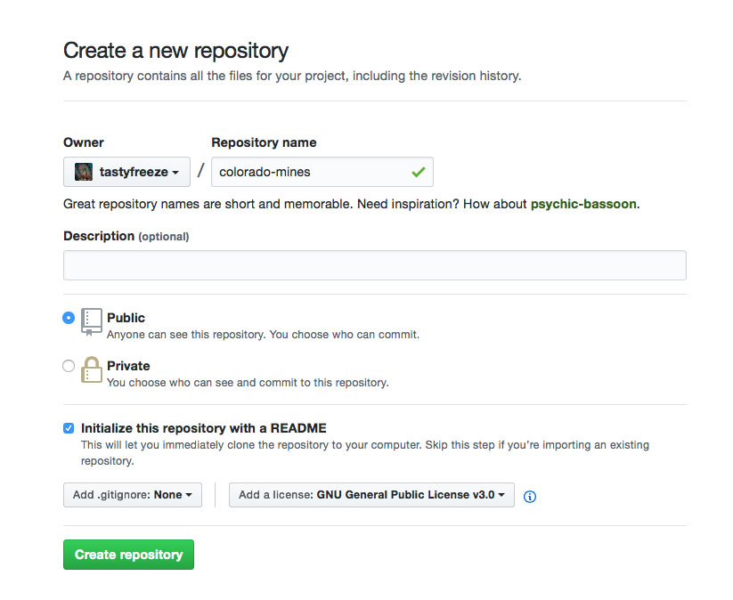

# Module 10: Final Map

<!-- TOC -->

- [Module 10: Final Map](#module-10-final-map)
    - [Map topic and data](#map-topic-and-data)
    - [Mapping process](#mapping-process)
    - [Deliverables and deadlines:](#deliverables-and-deadlines)

<!-- /TOC -->

For our final week of MAP 672 you'll create individual maps of a geography and dataset of your choosing. Because we only have one week for this map, the expectations and requirements will be modest. You should think of a simple geographic phenomenon you'd like to map, and more importantly one that you can represent with a dataset that will be easily and quickly obtained.

## Map topic and data

There are two ways to approach a mapping assignment such as this. The first is to think of a geographic place or problem and then seek out the data through internet searches, data portals, and governmental and NGO websites. The second way to peruse [existing data resources and portals](https://github.com/rgdonohue/resources), find an interesting dataset, and proceed with the mapping using that data.

Think back through the more recent labs and consider focusing your map on one of the three primary vector data structures for encoding geographic information: points, lines, or polygons.

**Points:**

If you chose to map point symbols, your options are either default Leaflet markers, markers using icons, or circles drawn as varying sizes relative to quantitative attribute values (proportional symbols) and/or colored using qualitative attribute values.

Point level data will likely come encoded within CSV files, Shapefiles, or GeoJSON. You'll want to convert the data to GeoJSON for the final Leaflet map. You can either use a desktop GIS such as QGIS for this conversion to GeoJSON or a web service such as [http://geojson.io](http://geojson.io) or [mapshaper](https://mapshaper.org/). Hint: remove unnecessary data attributes and reduce coordinate precision to minimize the file sizes.

**Lines:**

You may choose to map a linear phenomenon such as rivers, rail lines, bicycle routes, trails, or other infrastructure such as power lines. Linear data will likely come as Shapefiles and GeoJSON and again should be converted to GeoJSON as well.

**Areas:**

Use polygons to represent areal phenomena. These phenomena could be real-world object features such as buildings, properties, and parks, and encoded categorically using a nominal color scheme. Alternatively, they could be more abstract areal features such as political units, encoded using a sequential or divergent color scheme indicating varying quantities (remember that choropleth maps need to be standardized!).

## Mapping process

Follow these steps to begin your project:

**Step 1.** Obtain your data and convert it into a manageable GeoJSON data file (or set of files) as quickly as possible. GeoJSON data files should be no larger than 6 MB in size. 

Reach out to your instructor for help if you're having difficulty coming up with an idea or finding the data you want.

**Step 2.** Create a new repository on your personal GitHub account. Give the title of the repository a semantically meaningful name. For instance, if I'm going to map mines in Colorado, I would name the repository "colorado-mines" (no spaces!).
   
Keep this repository public so your instructor and fellow classmates can offer help.  Click the box to include a README.md when you initially create the repository and include a license as well (GNU General Public License v3.0 is excellent). For example:

  
*Creating a new GitHub repository*

Create the new repository and then add your instructor (double-check if you forgot their user id) as a collaborator in the GitHub settings so he can easily branch and push updates to your project.

Clone your new repository down to your local machine.

**Step 3.** Create a new *index.html* file for your map in the root directory of your repository. You'll want to begin with a basic template, drawing from one of the lesson/labs (either a map constrained by pixel width or percentage, or full screen). A few options are provided within this repository to help get you started:

  * [constrained map width](templates/template-constrained.html)
  * [full-page map width](templates/template-full.html)
  * [full-page mobile](templates/template-mobile.html)

You're free to use another HTML structure or template of your own design as well.

You'll then want to request the relevant Leaflet JS and CSS files, create the Leaflet map within your script, and likely load some "slippy" map tiles as well (see [Leaflet providers](https://leaflet-extras.github.io/leaflet-providers/preview/)). **Important:** be sure that the resources you request within your HTML document use the *https//* protocol and not the outdated *http//*.

Remember to commit your work using Git as you work and push up to your remote repository to backup.

**Step 4.** Create a *data/* directory within your repository and move your GeoJSON data files into this directory. Your files should be semantically named as well and end with either the *.json* or *.geojson* file extensions.

Load the data into your script using an AJAX request (Lesson 09). If you have multiple files to load into your script, you'll want to use a technique such as [JQuery's .when() method](https://api.jquery.com/jquery.when/) (or using the Fetch API shown in the Lesson 09 Addendum II).


Once you've loaded the data into the script, you can use the Leaflet `L.geoJson()` method to begin plotting and styling the data. Use the related method options and events to add basic interaction (affordances and tooltips) and filter the data in various ways. Remember that the [Leaflet layers control](https://leafletjs.com/examples/layers-control/) is useful for toggling on different layers of mapped features.

Remember to commit your work using Git as you work and push up to your remote repository to backup.

**Step 5.** Once you've created your thematic map, finish the page design with appropriate colors and typefaces, give the map a fun yet meaningful name (1. what is being mapped, 2. where the geography is, and 3. when the event or phenomena occured).

Remember to commit your work using Git as you work and push up to your remote repository to backup.

**Step 6.** Enable GitHub Pages to share your map with a URL. Go into the GitHub Settings and under GitHub Pages, select the master branch for GitHub Pages.

  
*Selecting the master branch for GitHub Pages*

Now, you can point your browser to https://*username*.github.io/*repository-name*/ and GitHub will serve your web page using HTTP requests (just like your local server environment). Free web hosting!

## Deliverables and deadlines:

* Aim to have a working draft of your map prior to the due date. Post a link to your map in the Canvas Discussion forum so fellow classmates can offer suggestions and feedback. Make sure you reciprocate the discussion! (2 pts)

* You need to complete the `publish.json` file which supports sharing your work with the world and controlling what information you present in a marker popup. This metadata file will help make a map [similar to this map](https://newmapsplus.github.io/projects/). 

  The template file [can be found here](templates/publish.json) and it must be placed in the root directory of your repository. Before you alter this file, look at the following properties that you need to change: (2 pts)

  ```js
  {
    // Required properties
    "title": "Title of Project", // Give your project a good title
    "info": "Add info about project", // A short blurb about your project
    "coordinates": [38, -84.5], // IMPORTANT: the lat, long centerpoint of your project

    // Optional properties
    // If you don't want to use these, use the value null without quotes.
    "author": "Do you want to add your name?", // What handle do you want to use?
    "link": "http://newmapsplus.uky.edu" // What's the link to the project or your social media?
  }
  ```

  Note: comments are not supported in the JSON format. Let's consider an example of a properly formatted `publish.json` file: 

  ```json
  {
    "title": "A map of NMP student projects",
    "info": "Students publish many public projects each semester. Let's show them!", 
    "coordinates": [34.5, -94.5],
    "author": "Folks at NMP",
    "link": "http://newmapsplus.uky.edu/projects"
  }
  ```


* Submit the URL link to your Github Pages map by the due date listed in Canvas. (6 pts)

Reach out and let me know if you want to Zoom.

Happy mapping!